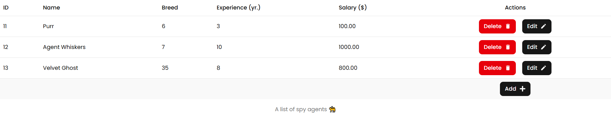
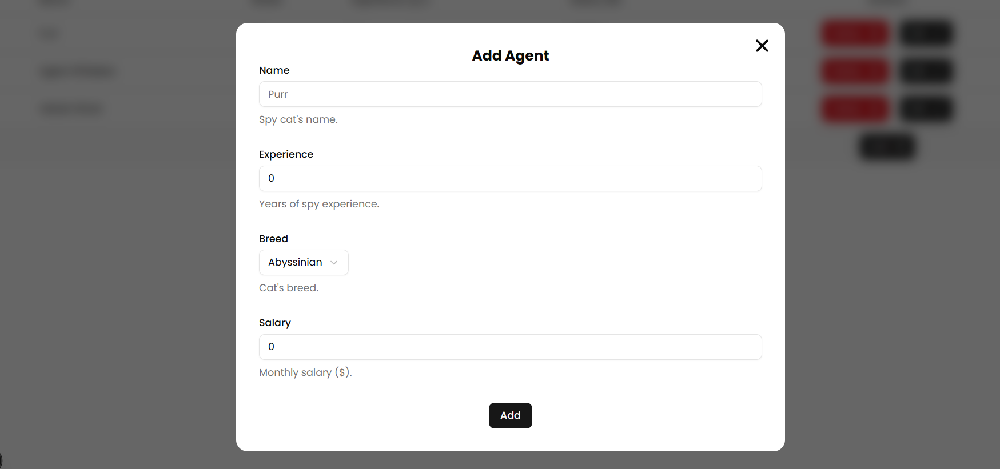
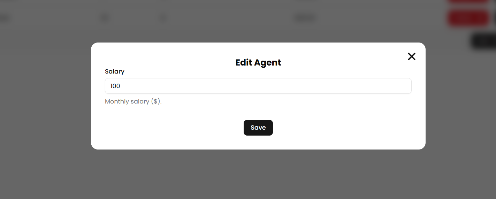
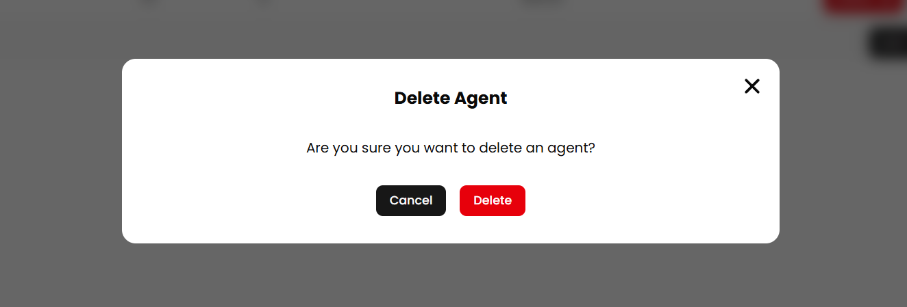

# Spy Cat Agency Frontend

## Installation

Firstly, clone the repo

```bash
git clone https://github.com/CrazyProger1/DevelopersToday-SCA-frontend.git
```

Then go to the folder

```bash
cd DevelopersToday-SCA-frontend
```

Install the dependencies

```bash
npm run install
```

And finally run the project

```bash
npm run dev
```

## Screenshots

<p align="center">

</p>

<p align="center">

</p>

<p align="center">

</p>

<p align="center">

</p>